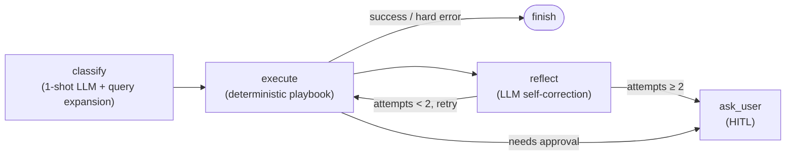
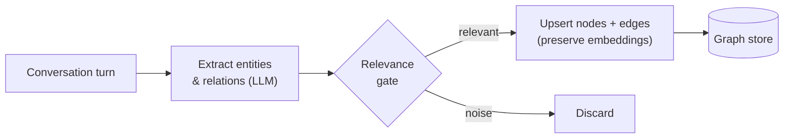

# Multi-Agent Workspace Assistant

> A **choreography-based** multi-agent AI assistant that drives Gmail, Drive, Calendar, and Google Docs through a single natural-language chat — no central orchestrator, just independent agents coordinating over a shared message bus and a Redis Blackboard.

  
  
  
  
  
  
  

A full, cloud-deployed, message-driven multi-agent system designed and built from the ground up.
This repository is the **showcase / overview** — the implementation lives in a set of focused
service repositories listed [below](#-repositories).

---

## ✨ What it does

Instead of clicking through four different Google apps, you type one request:

> *"Summarize my unread emails from this week and draft a reply to the one from the professor."*

The system interprets the intent, dispatches it to the right specialized agents, runs them
concurrently, pauses for your approval on sensitive actions, and streams the result back live.

- 🧠 **One conversational entry point** to Gmail, Drive, Calendar, and Docs
- 🐜 **Decentralized choreography** — agents are independent containers; add or remove one without touching the rest
- ✋ **Human-in-the-loop (HITL)** confirmation before any sensitive action (send email, create event)
- 🔗 **Graph-based memory** with a relevance gate that keeps context across turns without noise blow-up
- 📡 **Live status streaming** over SSE — watch each agent's state machine progress in real time

---

## 🏛️ Architecture — choreography, not orchestration

In an *orchestration* model a central controller calls each service in turn. This system uses
**choreography**: every component reacts to messages on a shared broker and publishes its own
results. There is no single point that knows the whole workflow, so agents stay fully decoupled —
a new domain agent plugs in just by subscribing to the broker.

```mermaid
flowchart TD
    FE["Web Frontend<br/>(React + Vite)"] -->|POST /chat · JWT| GW
    GW["API Gateway<br/>FastAPI · JWT · OAuth · SSE"] -->|publish intent.request| IG
    IG["Intent Gate<br/>(Gemini classify)"] -->|publish agent.&#123;name&#125;| MQ
    MQ(("RabbitMQ<br/>Control Plane"))
    MQ --> GM["Gmail Agent"]
    MQ --> DR["Drive Agent"]
    MQ --> CAL["Calendar Agent"]
    MQ --> DOC["Docs Agent"]
    GM & DR & CAL & DOC -->|read / write state| BB
    BB[("Redis Blackboard<br/>Data Plane · plan:&#123;id&#125;:context")]
    BB -.->|state stream| GW
    GW -.->|SSE chat.response| FE
    TR["Tracer"] -.->|eavesdrop all traffic| MQ
    GM & DR & CAL & DOC --> GAPI["Google Workspace APIs"]
```

### Two planes

| Plane | Component | Carries |
|---|---|---|
| **Control Plane** | RabbitMQ | Lightweight signals — IDs, actions, metadata. **No raw data.** |
| **Data Plane** | Redis Blackboard | All in-flight state & linked memory (`plan:{plan_id}:context`, stored as a Redis HASH so multi-pod workers write task slots without lost-update races). |

The Blackboard is the **single source of truth** for an in-flight request, decoupling the producer
of a result from its consumer.

### Each agent is a finite-state machine

Rather than an open-ended ReAct loop (which can stall or loop forever), every worker runs an
internal **LangGraph StateGraph**:

- **classify** — single LLM call: intent + strict-JSON params + automatic query expansion (handles abbreviations / accent-free Vietnamese).
- **execute** — deterministic Python playbook (the actual Google API calls).
- **reflect** — traps business errors (e.g. empty search results), rewrites the query broader, retries up to 2× before escalating.
- **ask_user** — HITL stop point. Implemented via **choreography** (an `ask_user` message + deferred downstream park), with the approval card's state persisted on the Blackboard so it survives a page reload.

### Graph memory

Conversations are distilled into a graph of entities and relations. A **relevance gate** filters
low-value information before writing — preventing the node explosion that sinks naive memory
systems — and existing embeddings are preserved on update so semantic search stays stable.

---

## 🧩 Repositories

The implementation is split into independent, separately deployable services (each its own container):

| Repo | Responsibility | Stack |
|---|---|---|
| **ai-workspace-gateway** | HTTP entry point — JWT auth, Google OAuth, request validation, SSE streaming | FastAPI |
| **ai-workspace-intent** | Intent Gate — classifies each request (Gemini Flash) and routes typed tasks | FastAPI · Gemini |
| **ai-workspace-gmail** | Search, read, summarize, draft, send email | LangGraph · Gmail API |
| **ai-workspace-drive** | Locate, list, manage Drive files | LangGraph · Drive API |
| **ai-workspace-calendar** | Create, query, manage events + interactive Calendar Canvas | LangGraph · Calendar API |
| **ai-workspace-docs** | Read and draft Google Docs content | LangGraph · Docs API |
| **ai-workspace-tracer** | Passively records all broker traffic for debugging & activity log | Redis |
| **ai-workspace-shared** | Common message envelopes, Blackboard client, DB schema, utilities | Python lib |
| **AI_agent_FE** | React + Vite chat UI with lazy-loaded per-domain tabs | React · TS · Vite |
| **ai-infra** | Cloud infrastructure as code — VM, network, firewall, registry | Terraform · Cloud Build |

> Service repos live in the [`MSESU2026`](https://github.com/MSESU2026) organization.

---

## 🛠️ Technology Stack

| Layer | Technology |
|---|---|
| Backend services | Python · FastAPI · LangGraph |
| LLM | Google Gemini (Flash-class) via native REST |
| Message broker | RabbitMQ |
| State store | Redis (Blackboard + trace log) |
| Database | PostgreSQL (users, OAuth tokens, history, memory) |
| Frontend | React · Vite · TypeScript |
| Edge / TLS | Nginx reverse proxy with origin certificates |
| Packaging | Docker · Docker Compose |
| Cloud | Google Compute Engine, provisioned with Terraform, built & deployed via Cloud Build |

For the demo the whole stack ran on a single Compute Engine VM behind Nginx, all backend
containers on one Docker network with only ports 80/443 public. The cloud resources were defined
as code in Terraform — fully reproducible, and torn down after the demo to avoid cost.

---

## 🔬 Design highlights worth a look

- **Architecture evolution v4 → v5.** v4 coordinated agents through a brittle shared *result-key* convention on the message payload. v5 replaces it with per-agent LangGraph FSMs + a Redis Blackboard as shared truth — markedly easier to reason about and extend.
- **UI-tool vs. Agent-tool.** Agent-tools run the full async choreography; UI-tools are direct synchronous REST calls (route preview, Calendar Canvas) for features needing an instant response — keeping the conversational path decoupled while UI stays snappy.
- **Cancel-No-Error.** Rejecting a HITL card cleanly stops all downstream tasks via a `__cancelled__` sentinel — no red errors, no orphaned parked tasks.
- **Unified encrypted credentials.** Per-service OAuth/service credentials are normalized into a single token format and encrypted at rest with **Fernet**, so every agent authenticates through one consistent, secured path.

---

## 🚧 Current trade-offs & future work

The coordination layer (choreography, HITL, Blackboard state, reload recovery) and credential
handling are solid. The open work is about answer quality and scale:

- **Worker accuracy vs. determinism.** Each worker is a deterministic LangGraph FSM rather than an open-ended ReAct loop — great for predictability and tracing, but the single `reflect` step is a weaker self-corrector than an unbounded agent loop, so a worker can still return an imperfect result on ambiguous queries. Stronger classify/reflect prompting (or a bounded-ReAct fallback inside the FSM) is the main lever for better answers.
- **LLM call latency.** End-to-end latency is dominated by the per-FSM LLM calls. Response caching, smaller/faster classify models, and parallelizing independent agent calls are the levers to pull.
- **Single-node deployment.** The system runs on one VM; horizontal scaling and HA are the next infra step — the choreography design already makes the stateless workers independently scalable.

---

## 👤 Author & Contributors

**Trần Tiến Cường** ([@cuongtt0201](https://github.com/cuongtt0201)) — *lead / author.* System
architecture & choreography design, API Gateway, Intent Gate, Redis Blackboard & graph memory,
LangGraph state-machine logic, shared library, Tracer, React frontend, and cloud infrastructure
(Terraform, Cloud Build, deployment).

**Nguyễn Trần Quốc Tính** — *contributor.* Domain worker agents (Gmail, Drive, Calendar, Docs)
and their Google Workspace API integration; extensibility research for future third-party
platforms (Slack, Microsoft 365, Notion).
